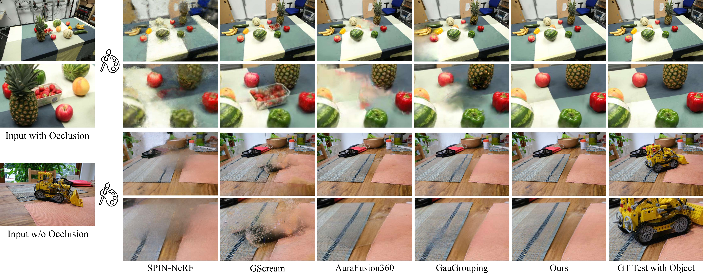

<p align="center">
  <h1 align="center">
    
    Inpaint360GS: Efficient Object-Aware 3D Inpainting via Gaussian Splatting for 360° Scenes
  </h1>

  <p align="center">
  <a href="https://shaoxiang777.github.io/"><strong>Shaoxiang Wang</strong></a>
  ·
  <a href="https://www.linkedin.com/in/shihong-zhang-97861a293/"><strong>Shihong Zhang</strong></a>
  · 
  <a href="https://scholar.google.com/citations?user=8p9OOd0AAAAJ&hl=en&oi=sra"><strong>Christen Millerdurai</strong></a>
  ·
  <a href="https://www.professoren.tum.de/westermann-ruediger"><strong>R&uuml;diger Westermann</strong></a>
  ·
  <a href="https://www.dfki.de/en/web/about-us/employee/person/dist01"><strong>Didier Stricker</strong></a>
  ·
  <a href="https://www.dfki.de/en/web/about-us/employee/person/alpa02"><strong>Alain Pagani</strong></a>
</p>

<p align="center"> <strong>WACV 2026</strong></p>
    <h3 align="center"><a href="https://dfki-av.github.io/inpaint360gs/">Project Page</a> | <a href="https://drive.google.com/drive/folders/1UIOPtSJ638VxqLm4yMEcE9hE5mGBwuHH?usp=sharing">Dataset</a> | <a href="https://arxiv.org/abs/2511.06457">Paper</a> | <a href="https://drive.google.com/drive/folders/1NgqE9SVL8e9BO4ZvIrRQHAhmGIdf9C6g?usp=sharing">Evaluation Result</a></h3>
    <div align="center"></div>
</p>


<p align="center">
  <a href="">
    
  </a>
</p>

<p align="center">
    Inpaint360GS performs flexible, object-aware 3D inpainting in 360° unbounded scenes —
    not only for individual objects, but also for complex multi-object environments.
</p>

## 📅 News
#### - 2026.01.19 All dataset, result and code released.
#### - 2025.09.05 Accepted in round 1 algorithm track


## Overall Running Steps
First download and zip the crowd sequence of Inpain360GS dataset
#### 1. Training Object-aware Gaussians 
#### 2. Select and Removing Objects
#### 3. Generating 2D Inpainted Color and Depth & 3D Inpaint


## 📂 Dataset Structure
**1. Inpaint360GS dataset has following structure:**
```yaml
  -data/
    - {inpaint360}/
      - {scene_name_1}/
        - images/
          - IMG_0001.JPG
          - IMG_0002.JPG
          - ...
          - IMG_0050.JPG
          - test_IMG_0051.JPG
          - test_IMG_0052.JPG
          - ...
          - test_IMG_0100.JPG
        - sparse/0
      - {scene_name_2}
```
All images in a scene share the same camera intrinsics and extrinsics.
```test_IMG_xxxx.JPG``` denotes the image after object removal, which serves as input for inpainting evaluation.

**2. Run on your own dataset:**
<details>
  <summary><b>Your scene structure</b></summary>

  ```yaml
    - data/
      - {your_scene_name}/
        - train_and_test/
          - input/
            - IMG_0001.JPG
            - IMG_0002.JPG
            - ...
            - IMG_0050.JPG
            - test_IMG_0051.JPG
            - test_IMG_0052.JPG
            - ...
            - test_IMG_0100.JPG
  ```
</details> 

Follow the image naming convention described above, then run:
```
bash scripts/run_data_prepare.sh
```

## Installation
You can refer to the [install document](./docs/install.md) to build the Python environment.

## 🚀 Quick Start (Demo)

### Download dataset
First, download the `inpaint360gs` dataset (and optional `others` dataset) and save them into the `./data` folder. 
```bash
bash scripts/download_inpaint360gs_dataset.sh

# optional: download result of inpaint360gs
bash scripts/download_inpaint360gs_result.sh
```


### 1. Training Object-aware Gaussians 

Run the segmentation and initial training script:
```bash
bash run_seg.sh
```

<details>
  <summary>[Config scene information]</summary>

The list of optional arguments is provided below:
|  Argument | Values | Default | Description |
|----------|---------|---------|-------------|
| `--dataset_name` | `"inpaint360gs"` or `"others"` | `"inpaint360gs"` | --- |
| `--scene` | `"doppelherz"`, `"toys"`, `"fruits"` ...| `"doppelherz"` | --- |
| `--resolution` | `1,2,4,8`| `2` | adjust according to GPU memory  |

</details>


### 2. Select and Removing Objects
Remove target objects and surrounding objects(multi object scene), then generate virtual camera poses
```bash
bash run_remove.sh
```

<details>
  <summary>[Config scene information]</summary>

**Note:** This stage should inherit `dataset_name`, `scene`, and `resolution` from the `run_seg.sh` stage.
Please refer to the `images_{resolution}_num` folder to identify the object IDs.

The list of specific arguments for removal is provided below:
|  Argument | Values | Description |
|----------|---------|-------------|
| `--target_id` | e.g., `"1,2,3"` | IDs of objects to be **permanently removed**. |
| `--target_surronding_id` | e.g., `"7,9"` | IDs of nearby objects that occlude the target in 2D views. They are removed **temporarily** and **automatically restored** during inpainting. |
| `--select_obj_id` | automatic | Do NOT need to give. The union of `target_id` + `target_surronding_id`. |
| `--removal_thresh` | `0.0` - `1.0` | Default: `0.7`. Probability threshold for removal. Lower this value if object edges are not cleanly removed. |

**Workflow Note:** At the end of this stage, we utilize **Segment-and-Track-Anything** to manually select/refine the specific regions for inpainting.

<p align="center">
  <video src="https://github.com/user-attachments/assets/89d48525-52c6-424f-ac46-207caed2a2ed" width="70%" controls muted autoplay loop>
  </video>
</p>


</details>


### 3. Generating 2D Inpainted Color and Depth & 3D Inpaint
```bash
# This step performs 2D inpainting using LaMa and subsequently optimizes the 3D Gaussian Splatting model to fill the missing regions.
bash run_inpaint.sh
```
<details>
  <summary>[Config scene information]</summary>

This stage should inherit `dataset_name`, `scene`, and `resolution` from the `run_seg.sh` stage.

**FAQ**: What should I do if the LaMa inpainting result is poor (e.g., the inpainted area appears too dark or inconsistent)?
This usually happens because LaMa relies on the context from pixels surrounding the mask. If the mask is too tight, the model lacks sufficient context to generate proper texture and lighting. You need to dilate the mask to include more surrounding context.
You can come to `tools/prepare_lama_data.py`, increase the `expand_pixels` parameter (Default: 10) in `enlarge` function. Try increasing it to `20` or `30`.
</details>

## Contact
You can contact the author through email: shaoxiang.wang@dfki.de.

## 📖 Citing
If you find our work useful, please consider citing:
```BibTeX
@inproceedings{wang2026inpaint360gs,
  title={Inpaint360GS: Efficient Object-Aware 3D Inpainting via Gaussian Splatting for 360deg Scenes},
  author={Wang, Shaoxiang and Zhang, Shihong and Millerdurai, Christen and Westermann, R{\"u}diger and Stricker, Didier and Pagani, Alain},
  booktitle={Proceedings of the IEEE/CVF Winter Conference on Applications of Computer Vision},
  pages={117--127},
  year={2026}
}
```

## Limitations and Future Work
An important limitation of the current framework is the absence of explicit environmental light modeling. Integrating ray tracing-based illumination
could improve visual fidelity, especially in scenes with shallow or complex depth distributions. In addition, future work includes investigating depth-guided 
feed-forward inpainting methods to support faster and more interactive 3D scene editing, potentially enabling real-time applications.


## 💖 Acknowledgement
We adapted some codes from some awesome repositories including [Gaussian Grouping](https://github.com/lkeab/gaussian-grouping), [InFusion](https://johanan528.github.io/Infusion/), [Gaga](https://www.gaga.gallery/) and [Uni-SLAM](https://shaoxiang777.github.io/project/uni-slam/). We sincerely thank the authors for releasing their implementations to the community.

This work has been partially supported by the EU projects CORTEX2 (GA No. 101070192) and LUMINOUS (GA No. 101135724), as well as by the German Research Foundation (DFG, GA No. 564809505). Special thanks to Shihong Zhang for his contributions during his Master's thesis at DFKI!

<br>
